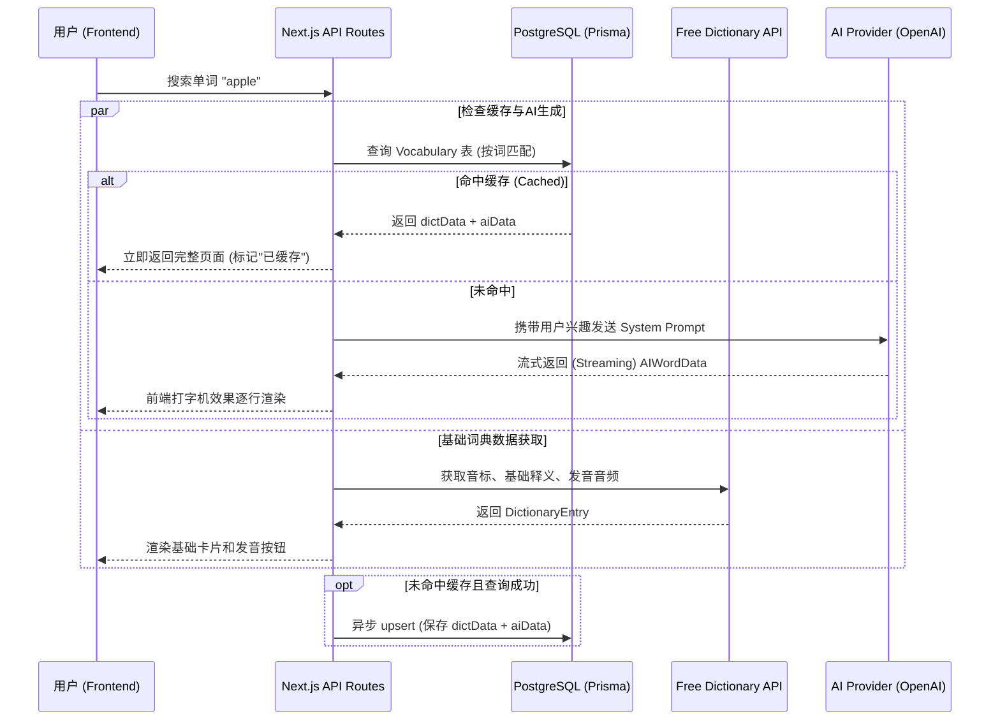
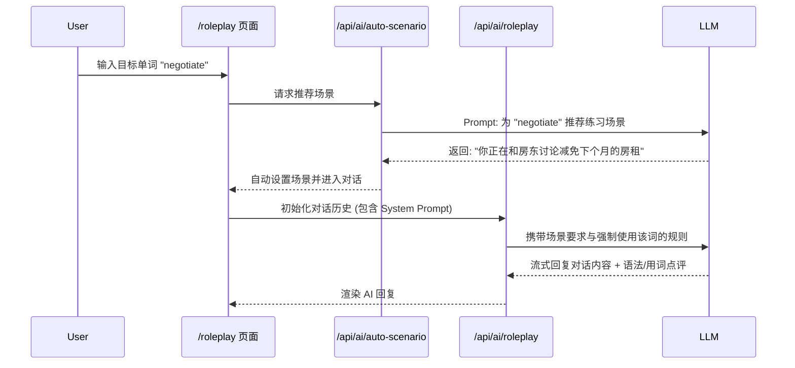

# AI 词典 (AI Dictionary) 项目架构文档

本项目是一个基于大语言模型（LLM）的智能英语学习工具，提供多义词详解、定制化例句、语境辨析、词源故事、脑洞记忆法、情景角色扮演等深度学习功能。

## 1. 技术栈 (Tech Stack)

*   **前端框架**: Next.js 16 (App Router) + React 19
*   **语言**: TypeScript
*   **样式与 UI**: Tailwind CSS v4 + shadcn/ui + Lucide Icons
*   **AI 交互**: Vercel AI SDK (`ai`, `@ai-sdk/openai`)
*   **数据库与 ORM**: PostgreSQL 16 + Prisma ORM
*   **部署**: Docker + Docker Compose (多阶段构建，Standalone 模式)

---

## 2. 核心运行流程 (Data Flow)

### 2.1 核心查词与缓存命中流程
为了提升响应速度并节省 AI Token，系统在查词时实现了数据库级别的完整缓存。



### 2.2 角色扮演对话流程 (Roleplay)
用户可以针对某个特定单词，让 AI 自动匹配场景并进行实战对话练习。



---

## 3. 核心功能模块解析

| 模块名称 | 路径/入口 | 功能描述 | 核心技术点 |
| :--- | :--- | :--- | :--- |
| **智能查词** | `/` (主页) | 即时查询入口，展示基础词意、AI 多义词详解、兴趣定制例句、语感辨析和词源故事，并自动写入缓存。 | `Vercel AI SDK` 流式输出，共用 `ai-parser` 做结构化 JSON 解析，Promise 并发请求。 |
| **生词学习中心** | `/vocabulary` | 集中管理已缓存单词：搜索/过滤、详情展开、复习模式、笔记、脑洞记忆法再生成、AI 生图辅助和单词对话。 | 数据库部分匹配过滤，按需拉取完整缓存行，复用查词缓存与 AI 辅助接口。 |
| **串词故事** | `/story` | 从生词本勾选 2-10 个单词，AI 自动编写一篇包含这些词的连贯小短文。 | 动态构建 Prompt，长文本流式生成。 |
| **角色扮演** | `/roleplay` | AI 自动匹配最佳使用场景，与用户进行情景对话，若用户使用错误会给予纠正反馈。 | AI 身份设定 (System Prompt) + 历史上下文管理。 |
| **场景表达** | `/scene` | 用户输入中文场景（如“在咖啡店点拿铁”），AI 提供地道英文表达、对话示例和文化禁忌。 | `zod` 定义多级嵌套 JSON 格式，强制 AI 按结构输出。 |
| **多模型配置** | `/settings` | 允许为不同任务（查词、生图、对话等）配置不同的 OpenAI 兼容端点和模型。 | 动态初始化 `createOpenAI` provider。 |

---

## 4. 目录结构与代码文件作用 (Directory Structure)

```text
ai_dictionary/
├── prisma/
│   ├── schema.prisma           # 数据库模型定义文件
│   └── migrations/             # 数据库迁移历史
├── src/
│   ├── app/                    # Next.js App Router 页面与 API
│   │   ├── api/
│   │   │   ├── ai/             # 所有 AI 相关的后端路由
│   │   │   │   ├── auto-scenario/route.ts # 为角色扮演自动生成场景
│   │   │   │   ├── image/route.ts         # DALL-E 生图接口
│   │   │   │   ├── lookup/route.ts        # 核心查词（流式 JSON 输出）
│   │   │   │   ├── mnemonic/route.ts      # 重新生成脑洞记忆法
│   │   │   │   ├── roleplay/route.ts      # 角色扮演对话流接口
│   │   │   │   ├── scene/route.ts         # 场景表达翻译接口
│   │   │   │   └── story/route.ts         # 串词故事生成接口
│   │   │   ├── dictionary/route.ts        # 请求 Free Dictionary 免费公共API
│   │   │   ├── settings/route.ts          # 获取/更新用户设置
│   │   │   └── vocabulary/
│   │   │       ├── route.ts               # 获取/删除生词本
│   │   │       └── save/route.ts          # 自动保存缓存词汇
│   │   ├── roleplay/page.tsx   # 情景对话页面
│   │   ├── scene/page.tsx      # 场景表达页面
│   │   ├── settings/page.tsx   # 设置页面（兴趣标签、API 密钥）
│   │   ├── story/page.tsx      # 串词故事页面
│   │   ├── vocabulary/page.tsx # 生词学习中心页面
│   │   ├── layout.tsx          # 全局布局 (包含顶部导航栏栏和字体配置)
│   │   └── page.tsx            # 主页 (核心查词结果渲染 UI)
│   ├── components/
│   │   ├── nav.tsx             # 顶部导航栏组件
│   │   └── ui/                 # shadcn/ui 基础组件库 (Button, Card, Input 等)
│   ├── lib/
│   │   ├── ai.ts               # 核心逻辑：定义所有 AI Prompt 模板和 Provider 初始化
│   │   ├── ai-parser.ts        # 查词 AI 响应解析与宽松结构化转换
│   │   ├── lookup-service.ts   # 查词缓存、解析、保存的服务层封装
│   │   ├── prisma.ts           # Prisma Client 全局单例实例化 (防热更新泄露)
│   │   └── utils.ts            # Tailwind 类名合并工具
│   └── types/
│       └── dictionary.ts       # 贯穿全局的 TypeScript 类型接口定义
├── docker-compose.yml          # Docker 服务编排 (App + DB + Migrate)
├── Dockerfile                  # 多阶段构建文件 (Standalone 优化)
└── start.sh                    # Docker 容器启动入口脚本
```

---

## 5. 数据库设计 (Database Schema)

位于 `prisma/schema.prisma`。核心表结构如下：

1. **`Vocabulary` (生词/缓存表)**
   - `word`: 单词（唯一索引）。
   - `dictData`: JSON 格式，存储 Free Dictionary API 的原始返回值（发音、音标等）。
   - `aiData`: JSON 格式，存储 AI 生成的完整解释（多义词、例句、记忆法等）。
   - `chineseDefinition`: 独立抽取的中文释义，用于在生词本列表中快速展示。
   - *作用*：不仅作为用户的生词本，同时作为全局查询缓存。

2. **`Settings` (用户设置表)**
   - `interests`: 字符串数组，存储用户的爱好（如“科幻”, “编程”），用于指导 AI 生成例句。
   - `customPrompt`: 用户自定义的额外 AI 指令。
   - `aiEndpoints`: JSON 格式，存储多组模型配置信息（URL, Key, Model名称，及其负责的任务类型）。

3. **`RoleplaySession` (对话会话表)**
   - `targetWord`, `scenario`: 目标词汇与当前场景。
   - `messages`: JSON 格式，完整保存用户与 AI 的聊天历史。

4. **`SearchHistory` (搜索历史表)**
   - 记录用户所有的搜索流水，用于统计（暂未在前端重点展示，仅做埋点）。

---

## 6. Docker 部署架构

项目配置了完整的 Docker 化方案，只需一条命令 `docker compose up -d` 即可在任何环境启动。架构由三个容器组成：

1. **`db` 容器**: 运行 `postgres:16-alpine` 官方镜像。暴露端口 `5433` (映射到内部的 5432，避免与主机现有 PG 冲突)，并将数据持久化挂载到 Docker Volume `pgdata`。
2. **`migrate` 容器 (Init Container)**: 这是一个一次性任务容器。它基于 Next.js 的代码镜像构建，启动时专门执行 `npx prisma migrate deploy` 尝试连接数据库并自动建表/升级 Schema。执行成功后自动退出。
3. **`app` 容器**: 核心 Node.js 应用容器。利用 Next.js 的 `standalone` 模式打包，体积小巧。它依赖于 `migrate` 容器的成功退出，确保启动时数据库表结构已经就绪。暴露端口 `3000` 供外部访问。
